# Dress To Impress — Program Flow

```mermaid
flowchart TD

    %% ─────────────────────────────────────────────
    %% SCENE 1: CHARACTER CREATION
    %% ─────────────────────────────────────────────

    subgraph SCENE1["Scene 1 · Character Creation"]
        direction TB

        subgraph DATA1["Data Layer"]
            CP["CharacterProfile\n(Runtime Singleton)\nstores feature indices"]
            CID["ClothingItemData\n(ScriptableObject)\nsprite · coords · tags · score"]
            JD["JudgeData\n(ScriptableObject)\nname · tags · dialogue · rewards"]
        end

        subgraph INPUT1["Input"]
            ISC["InputSpriteClick\nonMouseClick / onMouseEnter / onMouseExit"]
        end

        subgraph LOGIC1["Logic"]
            CC["CharacterCreator\nSelectBodyType / SelectHair\nSelectFacialFeature\nOnStartStyling()"]
        end

        subgraph VIEW1["View"]
            CD1["CharacterDisplay\nSetBodyType / SetHair\nSetFacialFeature\n17 sprite layers"]
        end

        ISC -->|"onMouseClick"| CC
        CC -->|"SetBodyType / SetHair\nSetFacialFeature()"| CD1
        CC -->|"updates indices"| CP
        CD1 -->|"onItemEquipped"| CC
    end

    CC -->|"OnStartStyling()\nload StylingRoom scene"| SCENE2

    %% ─────────────────────────────────────────────
    %% SCENE 2: STYLING ROOM
    %% ─────────────────────────────────────────────

    subgraph SCENE2["Scene 2 · Styling Room"]
        direction TB

        subgraph ROUND_START["Round Start"]
            SRM_START["StylingRoomManager\nStart()"]
            JM_PRESENT["JudgeManager\nPresentNextJudge()"]
        end

        subgraph JUDGE_UI["Judge Panel (UI)"]
            JUI_NAME["Judge Name display"]
            JUI_TAG["Style Tag display"]
            JUI_PROMPT["Prompt Text display"]
            JUI_AVATAR["Judge Portrait display"]
        end

        subgraph CLOTHING_LOOP["Clothing Selection (Repeatable)"]
            CPM["ClothingPanelManager\nShowCategory()\nOnItemButtonClicked()\nRefreshButtonStates()"]
            CD2["CharacterDisplay\nEquipItem() / UnequipCategory()\nToggleItem()\nGetAllEquippedClothing()"]
            TAB["Tab Buttons\n(Hat · Top · Bottom\nShoes · Accessory · …)"]
            ITEM_BTN["Item Buttons\n(one per ClothingItemData)"]
        end

        subgraph SUBMIT["Outfit Submission"]
            SUBMIT_BTN["SUBMIT OUTFIT button"]
            SRM_SUBMIT["StylingRoomManager\nOnSubmitOutfit()"]
            OS["OutfitScorer\nCalculateScore()\n= base + theme bonus + complete bonus\nclamped 0–100"]
        end

        subgraph REACTION["Judge Reaction (after 1.5 s delay)"]
            JM_REACT["JudgeManager\nReactToScore(score)\nGetRating() → Excellent / Good / Poor"]
            SCORE_UI["Score display\n(onScoreReady)"]
            DIALOGUE["Dialogue display\n(onJudgeDialogue)"]
            MONEY["Money counter\n(onMoneyAwarded)"]
            RATING_FX["Rating effect\n(onRatingDetermined\nonRatingExcellent/Good/Poor)"]
        end

        subgraph NEXT_ROUND["Next Round"]
            NEXT_BTN["NEXT button"]
            SRM_NEXT["StylingRoomManager\nOnNextJudge()\nunequip all · unlock panel"]
        end

        subgraph NAV["Navigation"]
            BOUTIQUE["OnGoToBoutique()"]
            MAIN_MENU["OnGoToMainMenu()"]
            ALL_DONE["onAllJudgesServed\n(max rounds reached)"]
        end

        %% Round Start
        SRM_START -->|"ApplyProfile(CharacterProfile)"| CD2
        SRM_START --> JM_PRESENT
        JM_PRESENT -->|"onJudgeNameSet"| JUI_NAME
        JM_PRESENT -->|"onStyleTagSet"| JUI_TAG
        JM_PRESENT -->|"onPromptSet"| JUI_PROMPT
        JM_PRESENT -->|"onAvatarSet"| JUI_AVATAR
        SRM_START -->|"onRoundStart"| CLOTHING_LOOP

        %% Clothing loop
        TAB -->|"click → ShowCategory()"| CPM
        ITEM_BTN -->|"click → OnItemButtonClicked()"| CPM
        CPM -->|"ToggleItem()"| CD2
        CD2 -->|"onItemEquipped\nonItemUnequipped"| CPM
        CPM -->|"RefreshButtonStates()\nhighlight equipped items"| ITEM_BTN

        %% Submit
        SUBMIT_BTN -->|"onClick"| SRM_SUBMIT
        SRM_SUBMIT -->|"SetInteractable(false)"| CPM
        SRM_SUBMIT -->|"onRoundEnd"| SUBMIT
        SRM_SUBMIT -->|"CalculateScore()"| OS
        OS -->|"GetAllEquippedClothing()"| CD2
        CD2 -->|"equipped items list"| OS

        %% Score result
        OS -->|"onScoreCalculated(score)"| SRM_SUBMIT
        SRM_SUBMIT -->|"onScoreReady(score)"| SCORE_UI
        SRM_SUBMIT -->|"DelayedReaction coroutine\nwait 1.5 s"| JM_REACT
        OS -->|"onRatingExcellent\nonRatingGood\nonRatingPoor"| RATING_FX

        %% Judge reaction
        JM_REACT -->|"onJudgeDialogue"| DIALOGUE
        JM_REACT -->|"onMoneyAwarded"| MONEY
        JM_REACT -->|"onRatingDetermined"| RATING_FX
        JM_REACT -->|"onAllJudgesServed"| ALL_DONE

        %% Next round
        NEXT_BTN -->|"onClick"| SRM_NEXT
        SRM_NEXT -->|"UnequipAllClothing()"| CD2
        SRM_NEXT -->|"SetInteractable(true)"| CPM
        SRM_NEXT -->|"PresentNextJudge()"| JM_PRESENT

        %% Navigation
        SRM_SUBMIT --> BOUTIQUE
        SRM_SUBMIT --> MAIN_MENU
    end

    %% ─────────────────────────────────────────────
    %% EDITOR TOOLS (outside runtime flow)
    %% ─────────────────────────────────────────────

    subgraph EDITOR["Editor Tools (Unity Editor only)"]
        CI["ClothingImporter\nScans Art/ folder\nGenerates ClothingItemData assets"]
        SS_CC["SceneSetup_CharacterCreation\nBuilds Scene 1 hierarchy\nwires all components"]
        SS_SR["SceneSetup_StylingRoom\nBuilds Scene 2 hierarchy\ncreates Tab + Item prefabs\nwires all components"]
    end

    CI -.->|"creates assets"| CID
    SS_CC -.->|"builds"| SCENE1
    SS_SR -.->|"builds"| SCENE2

    %% ─────────────────────────────────────────────
    %% DRAG-AND-DROP ALTERNATIVE (DressUpSlot mode)
    %% ─────────────────────────────────────────────

    subgraph DRAG["Drag-and-Drop Mode (alternative to panel)"]
        ISD["InputSpriteDrag\nonDragStart · onDragEnd\nonDropped · onReturned"]
        CI_ITEM["ClothingItem\n(scene-placed component)\ncategory · styleScore · themeTags"]
        DUS["DressUpSlot\ndrop target per category\nonItemEquipped · onItemRemoved · onSlotEmpty"]
    end

    ISD -->|"drag over slot → drop"| DUS
    DUS -->|"NotifyDropped()"| ISD
    CI_ITEM -->|"OnEquip / OnUnequip"| DUS

    %% ─────────────────────────────────────────────
    %% SHARED SCORING BRIDGE
    %% ─────────────────────────────────────────────

    JM_PRESENT -->|"GetCurrentThemeName()\nCurrentThemeHasTag()"| OS

    %% ─────────────────────────────────────────────
    %% STYLING
    %% ─────────────────────────────────────────────

    classDef data    fill:#dbeafe,stroke:#3b82f6,color:#1e3a5f
    classDef input   fill:#fef9c3,stroke:#ca8a04,color:#422006
    classDef logic   fill:#dcfce7,stroke:#16a34a,color:#14532d
    classDef view    fill:#fce7f3,stroke:#db2777,color:#500724
    classDef editor  fill:#f3f4f6,stroke:#9ca3af,color:#374151,stroke-dasharray:5 5

    class CP,CID,JD data
    class ISC,ISD input
    class CC,SRM_START,SRM_SUBMIT,SRM_NEXT,JM_PRESENT,JM_REACT,OS logic
    class CD1,CD2,CPM,JUI_NAME,JUI_TAG,JUI_PROMPT,JUI_AVATAR,SCORE_UI,DIALOGUE,MONEY,RATING_FX view
    class CI,SS_CC,SS_SR editor
```



## Key Flows at a Glance

| Flow | Path |
|---|---|
| **Character Creation** | `InputSpriteClick` → `CharacterCreator` → `CharacterDisplay` + `CharacterProfile` |
| **Scene Transition** | `CharacterCreator.OnStartStyling()` → loads Styling Room → `StylingRoomManager.Start()` applies profile |
| **Clothing Selection** | Tab click → `ClothingPanelManager.ShowCategory()` → item click → `CharacterDisplay.ToggleItem()` |
| **Submission & Scoring** | Submit button → `OutfitScorer.CalculateScore()` → `onScoreCalculated` → 1.5s delay → `JudgeManager.ReactToScore()` |
| **Round Reset** | Next button → `StylingRoomManager.OnNextJudge()` → unequip all → `JudgeManager.PresentNextJudge()` |
| **Drag-and-Drop alt** | `InputSpriteDrag` → `DressUpSlot` → `ClothingItem.OnEquip()` |

## Scoring Formula

```
score = (equippedCount × basePointsPerItem)
      + (themeMatchCount × themeBonusPerMatch)
      + (completeOutfitBonus  if  Hat ∧ Top ∧ Bottom ∧ Shoes all equipped)

score = clamp(score, minScore, maxScore)   // default 0–100
```

Rating thresholds (configurable on `OutfitScorer`):
- **Excellent** — score ≥ excellentThreshold
- **Good** — score ≥ goodThreshold
- **Poor** — score < goodThreshold
